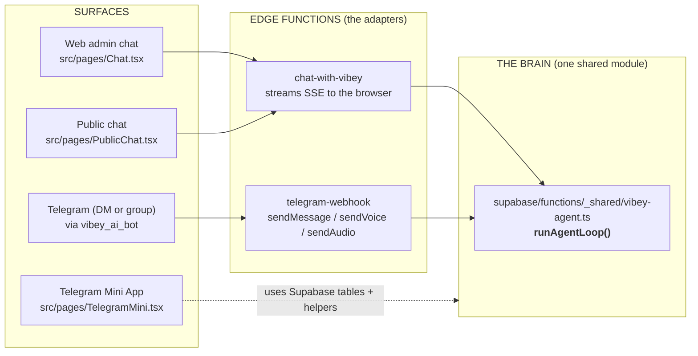
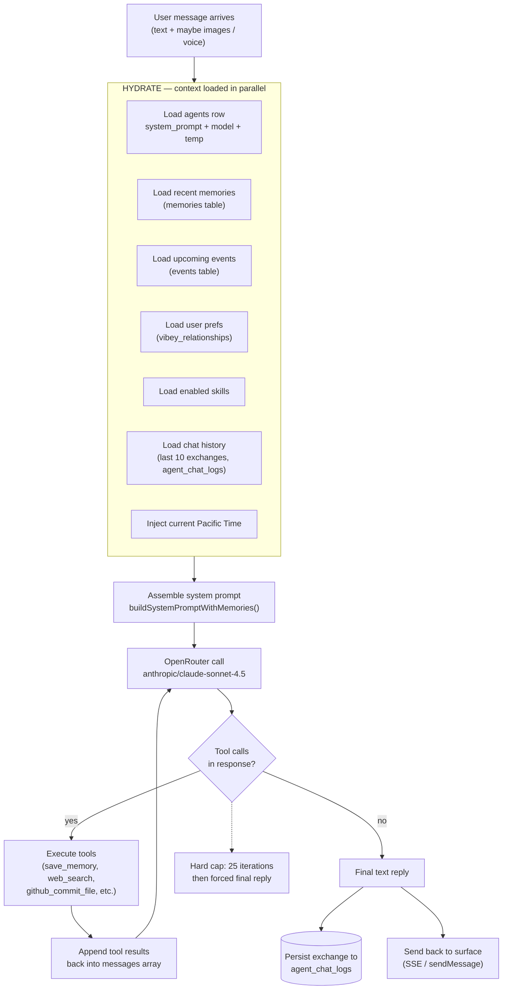
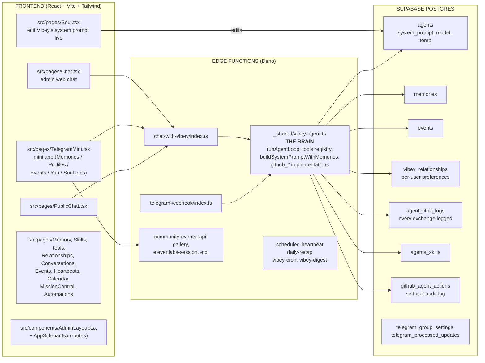

# CODEMAP — How Vibey thinks, end to end

> Read this first if you're (a) Vibey trying to edit yourself, or (b) a human trying to make a code change. It will save you 10 exploration steps. The brain lives in **one file**: `supabase/functions/_shared/vibey-agent.ts`.

---

## 1. The surface map — where messages come in and go out

**The rule:** every chat-shaped feature, regardless of surface, eventually calls `runAgentLoop` in `_shared/vibey-agent.ts`. If you want to change *how Vibey thinks*, you edit there — not in `src/lib/`, not in a per-surface edge function.

---

## 2. One request, step by step (inside runAgentLoop)

**Key constants** (in `_shared/vibey-agent.ts`):
- `MAX_TOOL_ITERATIONS = 25` — how many tool-call rounds before Vibey is forced to write a final reply
- `VIBEY_AGENT_ID` / `VIBEY_COMMUNITY_ID` — the canonical row IDs (single-agent today, multi-tenant DB)
- `ADMIN_TELEGRAM_USER_IDS` — who can trigger admin tools (`github_*`, `/voice`, etc.)

---

## 3. Where the code lives (the file map)

---

## 4. Decision tree — "I want to change X, where do I edit?"

| If you want to change… | Edit here | NOT here |
|---|---|---|
| Vibey's voice / personality | `agents.system_prompt` via the Soul tab in the admin UI (live, no deploy) | Anywhere in code |
| What tools Vibey can call | `_shared/vibey-agent.ts` — tools registry + executor switch | Per-surface edge function |
| What context Vibey loads | `buildSystemPromptWithMemories` and `loadX` helpers in `_shared/vibey-agent.ts` | `src/lib/` |
| How Telegram messages are parsed / rendered | `supabase/functions/telegram-webhook/index.ts` | `_shared/vibey-agent.ts` |
| How the web chat streams | `supabase/functions/chat-with-vibey/index.ts` + `src/pages/Chat.tsx` | `_shared/vibey-agent.ts` |
| Add a tab to the mini app | `src/pages/TelegramMini.tsx` | New file |
| Add a page to the web admin | New file in `src/pages/`, register route in `src/App.tsx` + `src/components/AppSidebar.tsx` | — |
| Add a DB column or table | New SQL file in `supabase/migrations/` + apply via Supabase MCP `apply_migration` | Raw SQL ad hoc |
| Add a scheduled background task | Edge function + cron entry; pattern lives in `scheduled-heartbeat` | — |
| Change Vibey's max steps per turn | `MAX_TOOL_ITERATIONS` in `_shared/vibey-agent.ts` | — |
| Add/remove an admin | `ADMIN_TELEGRAM_USER_IDS` in `_shared/vibey-agent.ts` | RLS policies |

---

## 5. Tools Vibey can currently call (high level)

**Memory:**
- `save_memory(content, tags?)`, `update_memory(id, content, tags?)`

**Web:**
- `web_search(query)`, `fetch_url(url)`, `get_vibe_price(...)`

**Self-edit (admin only):**
- `github_list_recent_commits`, `github_search_code` *(unreliable on this repo, prefer dir+read)*, `github_list_dir`, `github_read_file`, `github_commit_file`, `github_delete_file`

**Skills & tools:** dynamically loaded from `agents_skills` + the tools table.

---

## 6. Things to remember

1. **The brain is one file.** `_shared/vibey-agent.ts` is 92 KB. Big, but it's *the* canonical place. Don't fork it into `src/lib/`. (There used to be a dead `src/lib/chat.ts` from a confused self-edit attempt — it was deleted on 2026-05-20 with extreme prejudice.)
2. **Soul lives in the DB**, not in code. The Soul tab edits a single row.
3. **Vibey is admin-gated for code edits.** Only Telegram IDs in `ADMIN_TELEGRAM_USER_IDS` can trigger `github_*` tools or `/voice`. Standard users see no escalation.
4. **The DB is multi-tenant by design** (299 communities, 2 agents) but the app is hardcoded to one. Don't assume "the agent" or "the community" — use `VIBEY_AGENT_ID` and `VIBEY_COMMUNITY_ID`.
5. **`agent_chat_logs.session_key`** unifies sessions across surfaces. `telegram:<chat_id>` and `web:<auth_id>` are the two flavors.
6. **Time is anchored to Pacific.** Edge / Vibe House are in California. Telegram doesn't expose timezone, so PT is the default. If a user says they're elsewhere, Vibey can adapt from this anchor.
